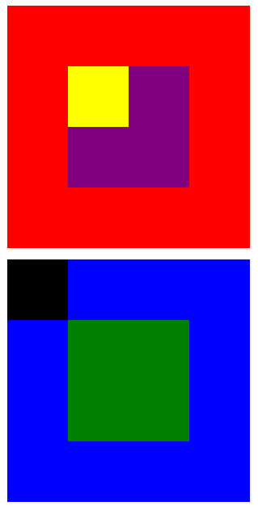

REPLICANDO LAS CAJAS DE COLORES
_____________________________

Esta página web es una réplica de las cajas de colores empleando los temas básicos de html y css, con esto se logran los principales objetivos tales como:

* Practicar codeando junto a tu equipo de profes, resolviendo ejercicios de html y css
* Practicar, practicar y practicar

A continuación te mostramos la imagen:

